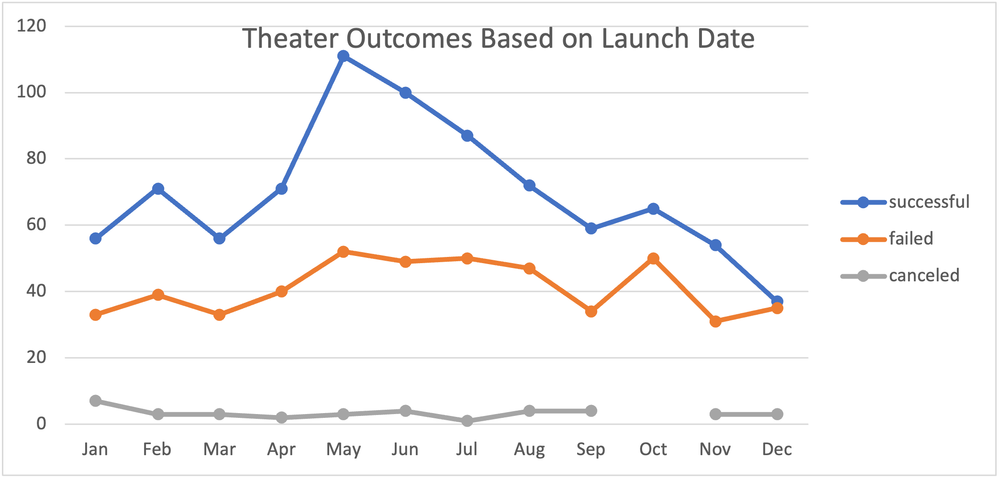
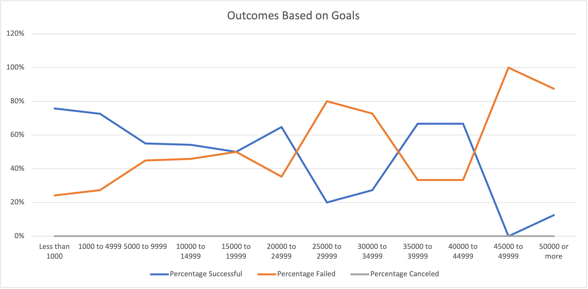

# kickstarter-analysis
Performing analysis on Kickstarter (crowdfunding) data to uncover trends

# Kickstarting with Excel

## Overview of Project

### Purpose
The purpose of this analysis is to determine how crowdfunding campaigns performed based off of their campaign launch date as well as their campaign fundraising goals. We are interested in looking at campaigns categorized specifically as theater and/or play due to our stakeholder's interest.

## Analysis and Challenges

### Analysis of Outcomes Based on Launch Date

The most successful theater campaigns (111) were launched in May. However, May, June, July, August, and October had roughly the same number of failed theater campaigns (~50).

### Analysis of Outcomes Based on Goals

From fundraising goals of $0-$29,999 the general trend of the successful campaigns is negative meaning that the the higher the fundraising goal is the 
lower the percentage of successful camppaigns. The highest percentage of successful campaigns were in the $0-$1000 campaign range.

### Challenges and Difficulties Encountered

## Results

- What are two conclusions you can draw about the Outcomes based on Launch Date?

- What can you conclude about the Outcomes based on Goals?

- What are some limitations of this dataset?

- What are some other possible tables and/or graphs that we could create?
I would suggest creating a table and/or line chart to view the trend between Number of Backers, Average Donations, and Goals. 
It would be interesting to answer the question: Do lower fundraising goals have fewer backers but higher average donations?
